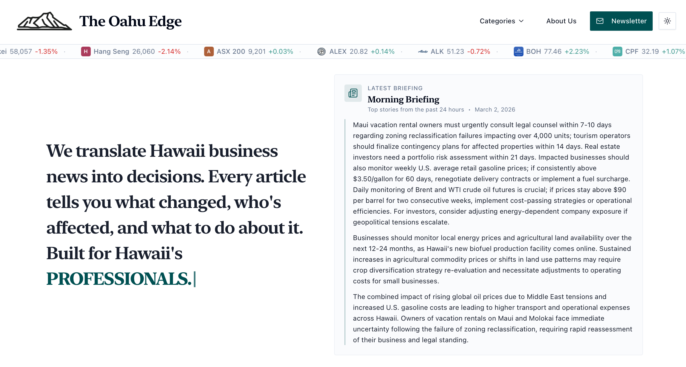
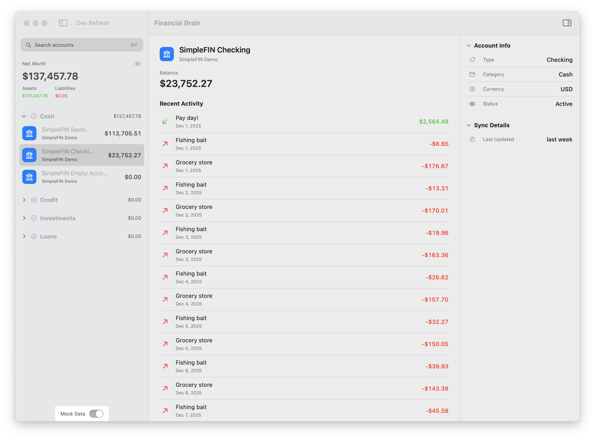
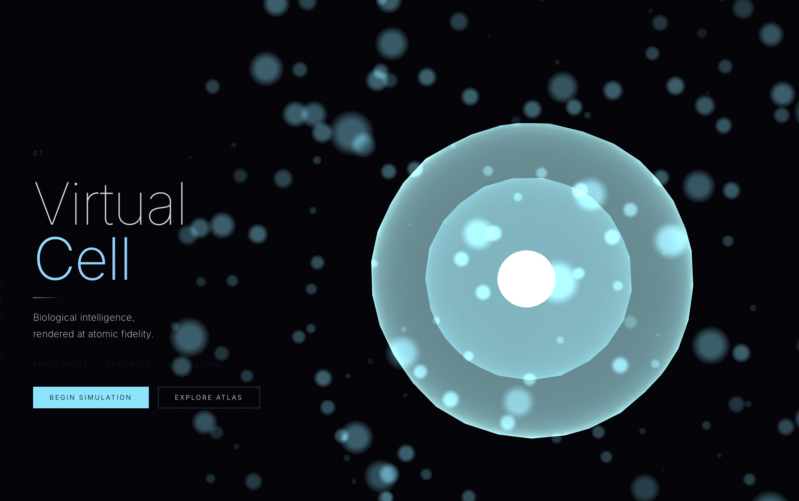
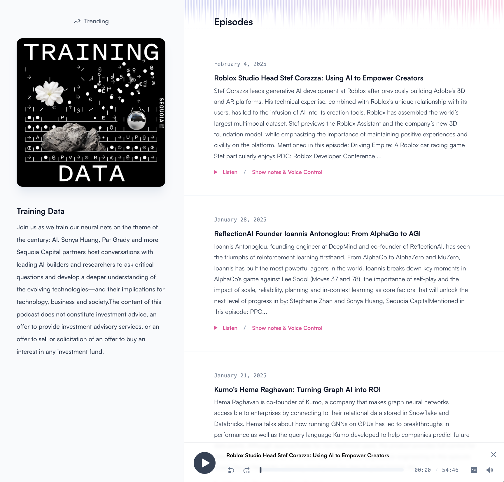
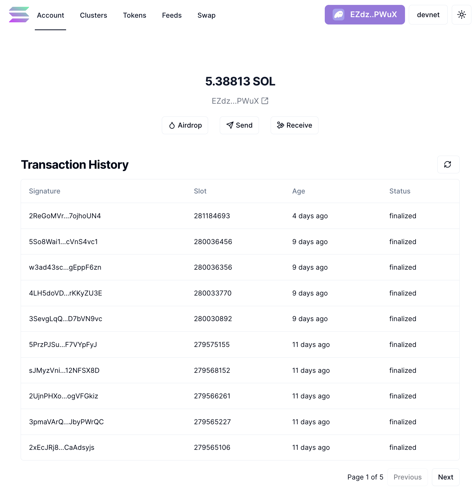

## Hi, I'm Dmitry 👋

I’m a **builder of end‑to‑end products** who loves taking ideas from zero to a polished, functional experience.

My background runs from **pro basketball in Europe** and **finance / prop trading** to over a decade of **designing and shipping web applications**, mostly for love, sometimes for money.

These days I’m especially interested in **AI‑powered workflows**, **beautiful, fast UIs**, and products that feel genuinely useful in the real world.

---

### Projects

<table>
  <tr>
    <td width="50%">
      
      <strong>🏝️ The Oahu Edge</strong> 
      AI‑powered decision‑support platform for entrepreneurs, investors, and professionals operating in Hawaii.
      🌐 <a href="https://www.theoahuedge.news">Demo</a>
    </td>
    <td width="50%">
      
      <strong>🛩️ JetShare</strong> 
      Book a single seat on a private jet to top conferences, festivals, and sporting events.
      🌐 <a href="https://www.flyjetshare.com">Demo</a>
  </tr>
  <tr>
    <td width="50%">
      
      <strong>💰 Financial Brain</strong> 
      Local‑first personal finance app for macOS, aggregating accounts via SimpleFIN Bridge.
      🔗 <a href="https://github.com/SkyHustle/FinancialBrain-public">Repo</a>
    </td>
    <td width="50%">
      
      <strong>🧬 Virtual Cell</strong> 
      WebGL‑powered, design‑complete proposal for a computational biology SaaS platform.
      🌐 <a href="https://virtual-cell.vercel.app">Demo</a>
      🔗 <a href="https://github.com/SkyHustle/virtual-cell">Repo</a>
    </td>
  </tr>
  <tr>
    <td width="50%">
      
      <strong>🎙️ Podcastic</strong> 
      Modern, feature‑rich podcast discovery and listening platform.
      🔗 <a href="https://github.com/SkyHustle/podcastic">Repo</a>
    </td>
    <td width="50%">
      
      <strong>🟣 Mega Solana Dapp</strong> 
      Clean front end that interacts with the Solana blockchain.
      🔗 <a href="https://github.com/SkyHustle/mega-solana-dapp">Repo</a>
    </td>
  </tr>
</table>
